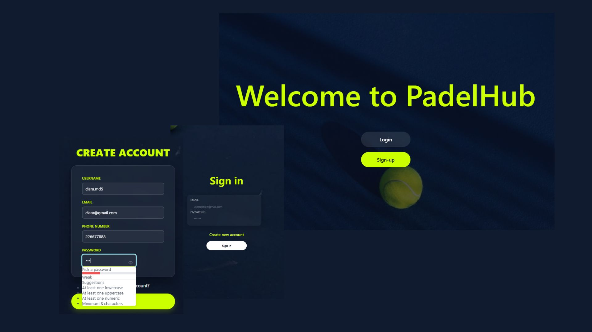
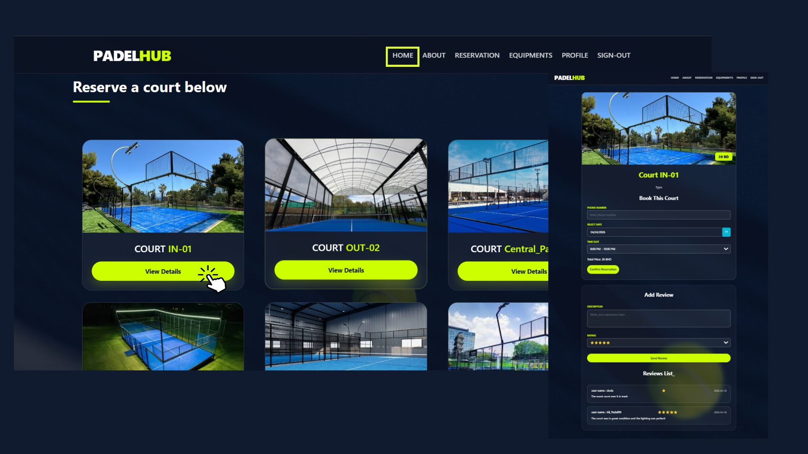
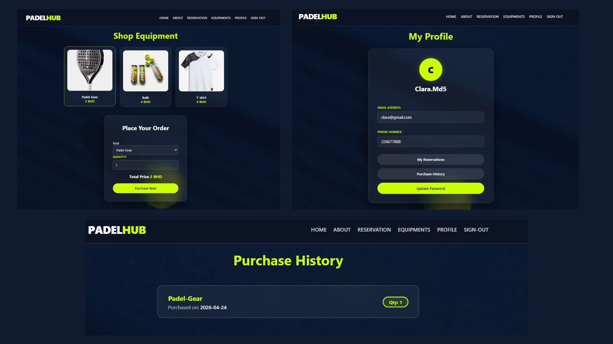

# PadelHub-backend
 Project 3 of general assembly software engineering

## Date: 16/4/2026

### By:
* Rehab Mohammed
* Intisar Hussain
* Hassan Mahfoodh
* Abdulla Hussain

### ***Description***
#### Padel Club Raed provides professional courts (indoor and outdoor) with the highest specifications. We make it easy for you to book, choose equipment, and enjoy the best padel facilities in Bahrain.
***

## 🔗 Frontend Repository
The client-side application for this project can be found here:
**[PadelHub Frontend Repository](https://github.com/intisarHJM/PadelHub-FrontEnd.git)**

### ***Technologies Used***
* Node.js
* Express.js
* npm
* MongoDB with Mongoose ODM
* JWT , CORS middleware
* React and Javascript

***

### ***Getting Started***

1.  Open the app and click Sign Up to create a new account. If you already have an account, click Sign In.

2. After logging in, the Home Page will appear. It shows all available courts.

- Click on any court to make a reservation.

- You can fill out the reservation form or scroll down to read user reviews.

3. Use the navigation bar at the top of the page to move between different pages.

4. The Reservation Page shows all your active reservations.

5. The Equipments Page is a small shop where you can buy padel equipment.

- Select the items and quantity you want.

- The total price will be shown automatically.

- Click Purchase Now to confirm your order.

- A message will appear to confirm your order was placed successfully.

6. Go to your Profile Page to:

- View your personal information

- Check your reservations

- See your purchase history

- Update your password using the last button on the page

7. To log out, click the Sign Out button in the top right corner of the navigation bar.

***

 **Planned Wireframe Illustration**

   

### ***Screenshots***

 **Final Project Design**
   

   *This screenshots shows the final result of the project design.*

***

### ***Future Updates***
- Add a membership system with exclusive member benefits.

- Make the equipment form clearer by showing the user’s order on the same page before confirming.

- Allow users to delete their own reviews.

- Allow users to cancel their orders without contacting an admin.

- Prevent users from entering non-numeric characters in the phone number field.

- Make sure reservation and order confirmation receipts are sent to the correct email or phone number.

- Add optional multi-factor authentication for users.

***

### ***Credits***
- PrimeReact - UI component library
- General Assembly course materials and lessons

***
