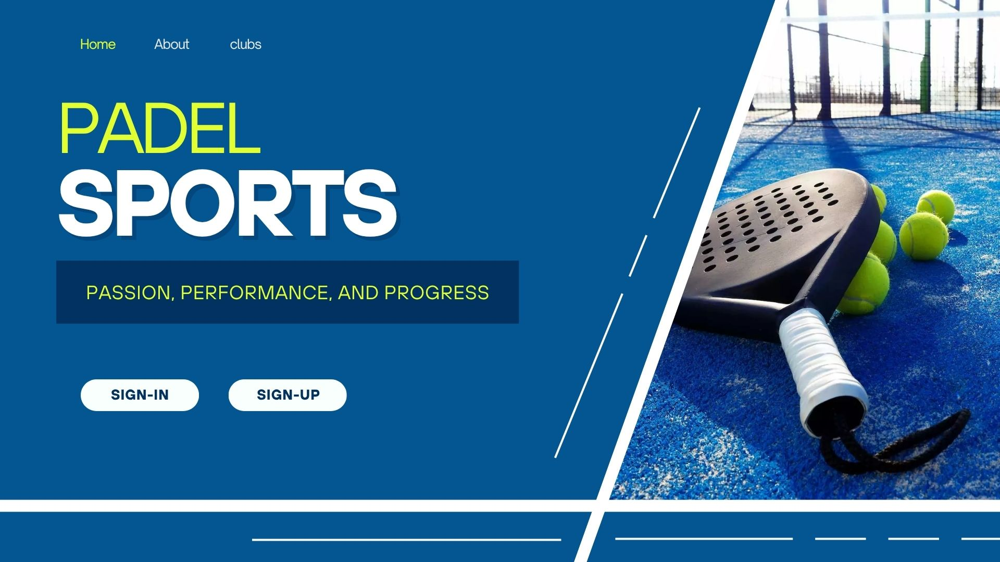
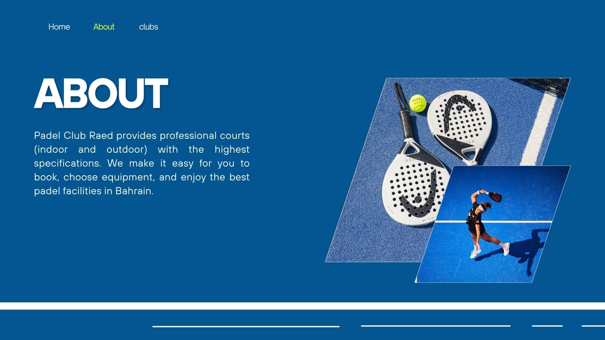
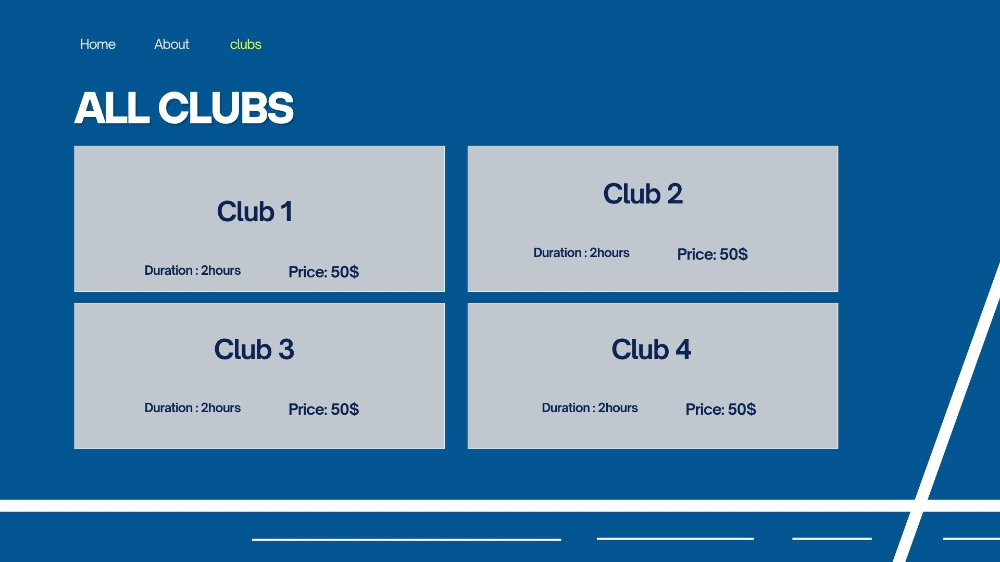
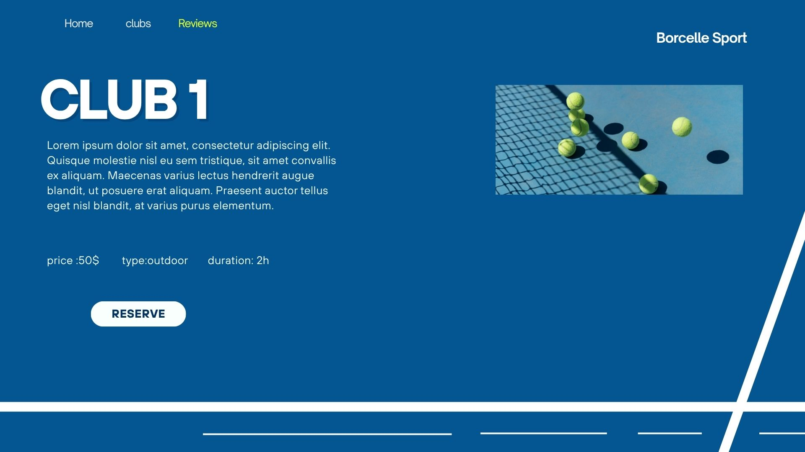
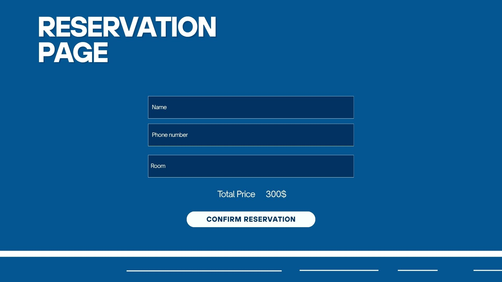

# PadelHub-backend
 Project 3 of software engineering

## Date: 16/4/2026

### By:
* Rehab Mohammed
* Intisar Hussain
* Hassan Mahfoodh
* Abdulla Hussain

#### [GitHub]

### ***Description***
#### Padel Club Raed provides professional courts (indoor and outdoor) with the highest specifications. We make it easy for you to book, choose equipment, and enjoy the best padel facilities in Bahrain.
***

## 🔗 Frontend Repository
The client-side application for this project can be found here:
**[PadelHub Frontend Repository](https://github.com/intisarHJM/PadelHub-FrontEnd.git)**

### ***Technologies Used***
* Node.js
* Express.js
* npm
* MongoDB with Mongoose ODM
* JWT , CORS middleware
* React and Javascript

***

### ***Getting Started***

##### to be declared

***

 **Planned Wireframe Illustration**

   

   

   

   

   

### ***Screenshots***

 **Final Project Design**
   
   *This screenshot shows the final result of the project design.*

***

### ***Future Updates***

To be declared

***

### ***Credits***

***
